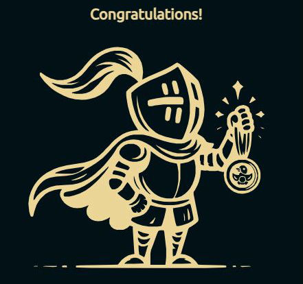

[everybody.codes](https://everybody.codes)

## 2024

<!-- @BEGIN:Quests:2024@ -->
| Quest | python3 | java | Rank | Points |
| --- | :---: | :---: | --- | --- |
|[1](https://everybody.codes/event/2024/quests/1)|[✓](src/main/python/2024_01.py)||&nbsp;657&nbsp;/&nbsp;&nbsp;583&nbsp;/&nbsp;&nbsp;559|&nbsp;&nbsp;-&nbsp;/&nbsp;&nbsp;&nbsp;-&nbsp;/&nbsp;&nbsp;&nbsp;-|
|[2](https://everybody.codes/event/2024/quests/2)|[✓](src/main/python/2024_02.py)||&nbsp;538&nbsp;/&nbsp;&nbsp;386&nbsp;/&nbsp;&nbsp;400|&nbsp;&nbsp;-&nbsp;/&nbsp;&nbsp;&nbsp;-&nbsp;/&nbsp;&nbsp;&nbsp;-|
|[3](https://everybody.codes/event/2024/quests/3)|[✓](src/main/python/2024_03.py)||&nbsp;306&nbsp;/&nbsp;&nbsp;303&nbsp;/&nbsp;&nbsp;297|&nbsp;&nbsp;-&nbsp;/&nbsp;&nbsp;&nbsp;-&nbsp;/&nbsp;&nbsp;&nbsp;-|
|[4](https://everybody.codes/event/2024/quests/4)|[✓](src/main/python/2024_04.py)||&nbsp;343&nbsp;/&nbsp;&nbsp;341&nbsp;/&nbsp;&nbsp;335|&nbsp;&nbsp;-&nbsp;/&nbsp;&nbsp;&nbsp;-&nbsp;/&nbsp;&nbsp;&nbsp;-|
|[5](https://everybody.codes/event/2024/quests/5)|[✓](src/main/python/2024_05.py)||&nbsp;264&nbsp;/&nbsp;&nbsp;244&nbsp;/&nbsp;&nbsp;227|&nbsp;&nbsp;-&nbsp;/&nbsp;&nbsp;&nbsp;-&nbsp;/&nbsp;&nbsp;&nbsp;-|
|[6](https://everybody.codes/event/2024/quests/6)|[✓](src/main/python/2024_06.py)||&nbsp;&nbsp;66&nbsp;/&nbsp;&nbsp;&nbsp;79&nbsp;/&nbsp;&nbsp;&nbsp;47|&nbsp;&nbsp;-&nbsp;/&nbsp;&nbsp;22&nbsp;/&nbsp;104|
|[7](https://everybody.codes/event/2024/quests/7)|[✓](src/main/python/2024_07.py)||&nbsp;&nbsp;71&nbsp;/&nbsp;&nbsp;&nbsp;45&nbsp;/&nbsp;&nbsp;&nbsp;59|&nbsp;&nbsp;-&nbsp;/&nbsp;&nbsp;56&nbsp;/&nbsp;&nbsp;92|
|[8](https://everybody.codes/event/2024/quests/8)|[✓](src/main/python/2024_08.py)||&nbsp;&nbsp;58&nbsp;/&nbsp;&nbsp;&nbsp;48&nbsp;/&nbsp;&nbsp;&nbsp;35|&nbsp;&nbsp;-&nbsp;/&nbsp;&nbsp;53&nbsp;/&nbsp;116|
|[9](https://everybody.codes/event/2024/quests/9)|[✓](src/main/python/2024_09.py)||&nbsp;&nbsp;39&nbsp;/&nbsp;&nbsp;215&nbsp;/&nbsp;&nbsp;202|&nbsp;12&nbsp;/&nbsp;&nbsp;&nbsp;-&nbsp;/&nbsp;&nbsp;&nbsp;-|
|[10](https://everybody.codes/event/2024/quests/10)|[✓](src/main/python/2024_10.py)||&nbsp;&nbsp;45&nbsp;/&nbsp;&nbsp;&nbsp;40&nbsp;/&nbsp;&nbsp;201|&nbsp;&nbsp;6&nbsp;/&nbsp;&nbsp;61&nbsp;/&nbsp;&nbsp;&nbsp;-|
|[11](https://everybody.codes/event/2024/quests/11)|[✓](src/main/python/2024_11.py)||&nbsp;107&nbsp;/&nbsp;&nbsp;&nbsp;58&nbsp;/&nbsp;&nbsp;&nbsp;59|&nbsp;&nbsp;-&nbsp;/&nbsp;&nbsp;43&nbsp;/&nbsp;&nbsp;92|
|[12](https://everybody.codes/event/2024/quests/12)|[✓](src/main/python/2024_12.py)||&nbsp;110&nbsp;/&nbsp;&nbsp;240&nbsp;/&nbsp;&nbsp;197|&nbsp;&nbsp;-&nbsp;/&nbsp;&nbsp;&nbsp;-&nbsp;/&nbsp;&nbsp;&nbsp;-|
|[13](https://everybody.codes/event/2024/quests/13)|[✓](src/main/python/2024_13.py)||&nbsp;&nbsp;29&nbsp;/&nbsp;&nbsp;&nbsp;28&nbsp;/&nbsp;&nbsp;&nbsp;39|&nbsp;22&nbsp;/&nbsp;&nbsp;73&nbsp;/&nbsp;112|
|[14](https://everybody.codes/event/2024/quests/14)|[✓](src/main/python/2024_14.py)||&nbsp;&nbsp;29&nbsp;/&nbsp;&nbsp;&nbsp;41&nbsp;/&nbsp;&nbsp;&nbsp;36|&nbsp;22&nbsp;/&nbsp;&nbsp;60&nbsp;/&nbsp;115|
|[15](https://everybody.codes/event/2024/quests/15)|[✓](src/main/python/2024_15.py)||&nbsp;&nbsp;62&nbsp;/&nbsp;&nbsp;124&nbsp;/&nbsp;&nbsp;&nbsp;54|&nbsp;&nbsp;-&nbsp;/&nbsp;&nbsp;&nbsp;-&nbsp;/&nbsp;&nbsp;97|
|[16](https://everybody.codes/event/2024/quests/16)|[✓](src/main/python/2024_16.py)||&nbsp;&nbsp;67&nbsp;/&nbsp;&nbsp;&nbsp;48&nbsp;/&nbsp;&nbsp;&nbsp;51|&nbsp;&nbsp;-&nbsp;/&nbsp;&nbsp;53&nbsp;/&nbsp;100|
|[17](https://everybody.codes/event/2024/quests/17)|[✓](src/main/python/2024_17.py)||&nbsp;115&nbsp;/&nbsp;&nbsp;113&nbsp;/&nbsp;&nbsp;&nbsp;63|&nbsp;&nbsp;-&nbsp;/&nbsp;&nbsp;&nbsp;-&nbsp;/&nbsp;&nbsp;88|
|[18](https://everybody.codes/event/2024/quests/18)|[✓](src/main/python/2024_18.py)||&nbsp;&nbsp;72&nbsp;/&nbsp;&nbsp;&nbsp;60&nbsp;/&nbsp;&nbsp;&nbsp;53|&nbsp;&nbsp;-&nbsp;/&nbsp;&nbsp;41&nbsp;/&nbsp;&nbsp;98|
|[19](https://everybody.codes/event/2024/quests/19)|[✓](src/main/python/2024_19.py)||&nbsp;&nbsp;59&nbsp;/&nbsp;&nbsp;&nbsp;51&nbsp;/&nbsp;&nbsp;&nbsp;47|&nbsp;&nbsp;-&nbsp;/&nbsp;&nbsp;50&nbsp;/&nbsp;104|
|[20](https://everybody.codes/event/2024/quests/20)|[✓](src/main/python/2024_20.py)|[✓](src/main/java/com/github/pareronia/everybody_codes/Quest2024_20.java)|&nbsp;129&nbsp;/&nbsp;&nbsp;&nbsp;92&nbsp;/&nbsp;&nbsp;&nbsp;64|&nbsp;&nbsp;-&nbsp;/&nbsp;&nbsp;&nbsp;9&nbsp;/&nbsp;&nbsp;87|
<!-- @END:Quests:2024@ -->

## 2025

<!-- @BEGIN:Quests:2025@ -->
| Quest | python3 | java | Rank | Points |
| --- | :---: | :---: | --- | --- |
|[1](https://everybody.codes/event/2025/quests/1)|[✓](src/main/python/2025_01.py)|[✓](src/main/java/com/github/pareronia/everybody_codes/Quest2025_01.java)|&nbsp;763&nbsp;/&nbsp;&nbsp;686&nbsp;/&nbsp;&nbsp;643|&nbsp;&nbsp;-&nbsp;/&nbsp;&nbsp;&nbsp;-&nbsp;/&nbsp;&nbsp;&nbsp;-|
|[2](https://everybody.codes/event/2025/quests/2)|[✓](src/main/python/2025_02.py)||&nbsp;544&nbsp;/&nbsp;&nbsp;441&nbsp;/&nbsp;&nbsp;434|&nbsp;&nbsp;-&nbsp;/&nbsp;&nbsp;&nbsp;-&nbsp;/&nbsp;&nbsp;&nbsp;-|
|[3](https://everybody.codes/event/2025/quests/3)|[✓](src/main/python/2025_03.py)||&nbsp;421&nbsp;/&nbsp;&nbsp;414&nbsp;/&nbsp;&nbsp;405|&nbsp;&nbsp;-&nbsp;/&nbsp;&nbsp;&nbsp;-&nbsp;/&nbsp;&nbsp;&nbsp;-|
|[4](https://everybody.codes/event/2025/quests/4)|[✓](src/main/python/2025_04.py)||&nbsp;122&nbsp;/&nbsp;&nbsp;130&nbsp;/&nbsp;&nbsp;138|&nbsp;&nbsp;-&nbsp;/&nbsp;&nbsp;&nbsp;-&nbsp;/&nbsp;&nbsp;13|
|[5](https://everybody.codes/event/2025/quests/5)|[✓](src/main/python/2025_05.py)|[✓](src/main/java/com/github/pareronia/everybody_codes/Quest2025_05.java)|&nbsp;114&nbsp;/&nbsp;&nbsp;106&nbsp;/&nbsp;&nbsp;116|&nbsp;&nbsp;-&nbsp;/&nbsp;&nbsp;&nbsp;-&nbsp;/&nbsp;&nbsp;35|
|[6](https://everybody.codes/event/2025/quests/6)|[✓](src/main/python/2025_06.py)||&nbsp;124&nbsp;/&nbsp;&nbsp;122&nbsp;/&nbsp;&nbsp;144|&nbsp;&nbsp;-&nbsp;/&nbsp;&nbsp;&nbsp;-&nbsp;/&nbsp;&nbsp;&nbsp;7|
|[7](https://everybody.codes/event/2025/quests/7)|||||
|[8](https://everybody.codes/event/2025/quests/8)|||||
|[9](https://everybody.codes/event/2025/quests/9)|||||
|[10](https://everybody.codes/event/2025/quests/10)|||||
|[11](https://everybody.codes/event/2025/quests/11)|||||
|[12](https://everybody.codes/event/2025/quests/12)|||||
|[13](https://everybody.codes/event/2025/quests/13)|||||
|[14](https://everybody.codes/event/2025/quests/14)|||||
|[15](https://everybody.codes/event/2025/quests/15)|||||
|[16](https://everybody.codes/event/2025/quests/16)|||||
|[17](https://everybody.codes/event/2025/quests/17)|||||
|[18](https://everybody.codes/event/2025/quests/18)|||||
|[19](https://everybody.codes/event/2025/quests/19)|||||
|[20](https://everybody.codes/event/2025/quests/20)|||||
<!-- @END:Quests:2025@ -->

## Story 1

<!-- @BEGIN:Quests:1@ -->
| Quest | python3 | java | Rank | Points |
| --- | :---: | :---: | --- | --- |
|[1](https://everybody.codes/story/1/quests/1)|[✓](src/main/python/S01_01.py)||&nbsp;208&nbsp;/&nbsp;&nbsp;157&nbsp;/&nbsp;&nbsp;138|&nbsp;&nbsp;-&nbsp;/&nbsp;&nbsp;&nbsp;-&nbsp;/&nbsp;&nbsp;13|
|[2](https://everybody.codes/story/1/quests/2)|[✓](src/main/python/S01_02.py)||&nbsp;135&nbsp;/&nbsp;&nbsp;128&nbsp;/&nbsp;&nbsp;115|&nbsp;&nbsp;-&nbsp;/&nbsp;&nbsp;&nbsp;-&nbsp;/&nbsp;&nbsp;36|
|[3](https://everybody.codes/story/1/quests/3)|[✓](src/main/python/S01_03.py)||&nbsp;123&nbsp;/&nbsp;&nbsp;120&nbsp;/&nbsp;&nbsp;113|&nbsp;&nbsp;-&nbsp;/&nbsp;&nbsp;&nbsp;-&nbsp;/&nbsp;&nbsp;38|
<!-- @END:Quests:1@ -->
